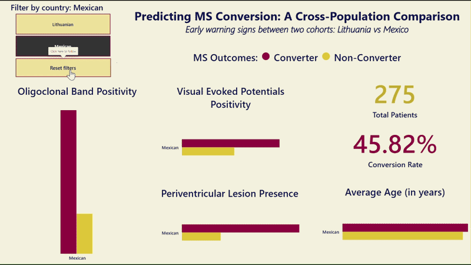
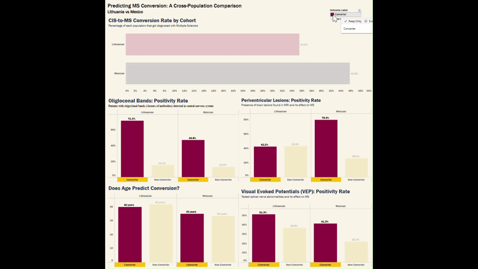

# CIS-to-MS Conversion Predictors: A Cross-Population Comparison of Mexican and Lithuanian Clinical Cohorts
The central question: which patients with Clinically Isolated Syndrome (CIS) went on to develop Multiple Sclerosis (MS), and which clinical signs predicted it?

## Overview

<!-- Briefly describe the project: what question it answers, why it matters, and the approach taken. -->
This is a complete data analysis of clinical predictors of MS, an autoimmune disease without a cure. It can affect vision, mobility, balance, cognitive function, and in severe cases, can be fatal. Treatments exist that slow progression significantly, but none reverse existing damage. This makes early diagnosis critically important. The datasets used follow patients who experienced a first neurological episode (Clinically Isolated Syndrome, or CIS) and track which ones went on to develop MS, comparing clinical signs between those who converted and those who did not. I care particularly about this topic because my great-aunt battled MS. Witnessing her deterioration as a child - from an independent, courageous woman to wheelchair-bound, then bedridden - was rapid and heart-wrenchingly unfair. She eventually succumbed to pneumonia in hospital.

## Clinical Context
Identifying patients who are at high risk for conversion at the Clinically Isolated Syndrome (CIS) stage allows for quicker treatment plans _before_ a second attack causes additional, irreversible damage. Every lesion halted from forming is neurological function saved. Conversion rates from published studies fall in the 30-50% range, meaning 30-50% of patients with a CIS episode eventually receive an MS diagnosis.

## Data Sources

| Dataset | Population | Patients | Source | Licence | Notes |
|---|---|---|---|---|---|
| `data/raw/lithuanian_cis.xlsx` | Lithuanian | 138 | Balnytė R et al. Medicina. 2022;58(9):1178. [Mendeley](https://data.mendeley.com/datasets/yjfydt34rs/1) | CC BY 4.0 | 44 columns; 1 ghost row dropped; outcome column: MS (1=converted, 0=did not) |
| `data/raw/mexican_cis.xlsx` | Mexican | 288 | Chavarria A et al. Mult Scler Relat Disord. 2023. [Mendeley](https://data.mendeley.com/datasets/8wk5hjx7x2/1) | CC BY 4.0 | 18 columns after dropping EDSS (>50% null); outcome column: group (1=converter, 2=non-converter); 13 null-outcome rows retained in cleaned data but excluded from analysis |

<!-- Add any data access restrictions or citations here. -->

## Tools Used

- **Python** (pandas, matplotlib, seaborn, scikit-learn) - data cleaning, EDA, and visualisation
- **SQLite** - cross-population querying via a UNION view
- **Jupyter Notebooks** - primary working environment
- **Power BI Desktop** - interactive dashboard with DAX measures
- **Tableau Public** - second dashboard and improved charts, [published online](https://public.tableau.com/views/CIStoMSConversionRate-LithuaniavsMexico/MSConversionDashboard?:language=en-US&:sid=&:redirect=auth&:display_count=n&:origin=viz_share_link)

## Project Pipeline

1. **Data Inspection**: raw exploration of both datasets, shape, data types, null counts
2. **Data Cleaning**: ghost row removal, EDSS column drop, binary column engineering (`ogb_bin`, `vep_bin`, `peri_bin`)
3. **SQLite Analysis**: cross-population UNION query to produce `cross_population_union.csv`
4. **EDA**: data visualisations across both cohorts maintaining colour consistency
5. **Power BI Dashboard**: 10 DAX measures, 1 slicer, 4 charts, 2 cards ([`ms_cis_dashboard.pbix`](powerbi/CIS-to-MS%20Conversion%20Dashboard.pbix))
6. **Tableau Dashboard**: 5 worksheets mirroring DAX logic, dashboard published to Tableau Public
7. **ML Classification**: logistic regression and random forest to test which clinical features predict conversion

## Key Findings

<!-- Summarise the most important results once the analysis is complete. -->
- **Oligoclonal bands (OGB)** were the strongest cross-population predictor of conversion. Positivity rates were consistently higher in converters across both cohorts (Lithuanian: 71% vs 15%; Mexican: 47% vs 13%).
- **Periventricular MRI lesions** showed the largest single numerical gap in the Mexican cohort (79% vs 26%), but did not replicate in the Lithuanian cohort and should be interpreted with caution.
- **Visual evoked potential (VEP)** positivity was higher in converters in both cohorts (Lithuanian: 51% vs 37%; Mexican: 41% vs 22%), suggesting a consistent but secondary signal.
- **Age at presentation** showed no meaningful difference between converters and non-converters in either cohort, making it a deliberate negative finding.
- **Machine learning confirmation** - logistic regression confirmed OGB as the strongest binary predictor of conversion (coefficient +2.0), consistent with the EDA findings.

## Dashboards
### Power BI


Built in Power BI Desktop with 10 DAX measures and a cohort slicer. The `.pbix` file is in [`powerbi/`](powerbi/) (requires Power BI Desktop to open).

### Tableau


Published to Tableau Public. View the live dashboard [here](https://public.tableau.com/views/CIStoMSConversionRate-LithuaniavsMexico/MSConversionDashboard). The `.twbx` file is in [`tableau/`](tableau/).

## How to Run
If you wanted to reproduce the Python analysis on your own machine!

### 1. Clone the repository

```bash
git clone https://github.com/jolgan/ms-cis-comparison.git
cd ms-cis-comparison
```

### 2. Create and activate a virtual environment
A virtual environment helps to prevent Python package conflicts between projects.

Example: Project A uses Pandas v1.5 but project B uses Pandas v2.2.
Without isolation, installing one version could break the other project.
```bash
python -m venv .venv
# Windows
.venv\Scripts\activate
# macOS / Linux
source .venv/bin/activate
```

### 3. Install dependencies
Installs all the Python libraries the notebooks need.
```bash
pip install -r requirements.txt
```

### 4. Run the notebooks

Open the [`notebooks/`](notebooks/) folder in Jupyter Lab or VS Code and run in order.

## References

Full references, including datasets, clinical background sources, and conversion rate benchmarks, are documented in [references.md](references.md).

---

*Analysis by [Jolene Gan](https://www.linkedin.com/in/jolenegan)*
